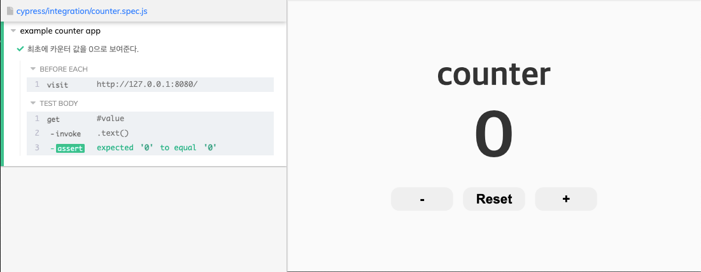

# cypress-test-logic

> 일정: 2022-02-04
>
> 목표: Cypress로 더 좋은 테스크 코드를 짤 수 있는 방법을 배우고, 더 나아가 놓쳤던 부분을 알아가기
>
> 강의: [인프런] 하루만에 Cypress로 작성하는 자바스크립트 E2E 테스트 코드
>

## 목차
- [X] counter의 초기값은 0이다.
- [ ] +버튼을 클릭 시, count가 1 증가한다.
- [ ] -버튼을 클릭 시, count가 1 감소한다.
- [ ] +버튼을 눌렀을 때, count가 10이 넘는 경우 더 이상 증가하지 못한다. (Max 값이 10이다.)
- [ ] -버튼을 눌렀을 때, count는 0보다 작아지는 경우 감소하지 못한다. (Min 값이 0이다.)
- [ ] reset 버튼을 누르면 counter가 0으로 초기화된다.


## Getting Started

Installing Cypress
```zsh
npm install cypress --save-dev
// or
yarn add cypress --dev
```

Opening Cypress
```zsh
./node_modules/.bin/cypress open
// or
npx cypress open
// or
yarn run cypress open
```

1. Counter
HTML
```html
// index.html
<div id="app">
    <div class="container">
        <h1 class="title">counter</h1>
        <span id="value">0</span>
        <div class="button-container">
            <button class="btn decrease-btn">-</button>
            <button class="btn reset-btn">Reset</button>
            <button class="btn increase-btn">+</button>
        </div>
    </div>
</div>
```
Cypress
```javascript
// counter.spec.js
describe("example counter app", () => {
  beforeEach(() => {
   cy.visit("http://127.0.0.1:8080/");
  });

  it("최초에 카운터 값을 0으로 보여준다.", () => { // title
    cy.get("#value").invoke("text").should("eq", "0"); // id는 value이고, invoke는 text로 0이다.
  })
});
```

cypress 결과



