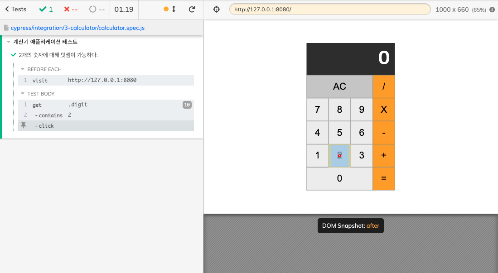
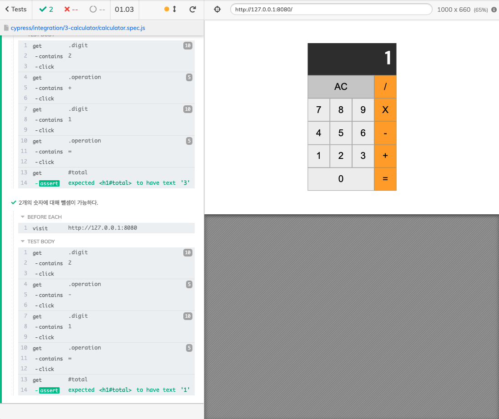

# Calculator Cypress

> 일정: 2022-02-05
>
> 목표: Cypress로 더 좋은 테스크 코드를 짤 수 있는 방법을 배우고, 더 나아가 놓쳤던 부분을 알아가기
>
> 강의: [인프런] 하루만에 Cypress로 작성하는 자바스크립트 E2E 테스트 코드
>

## 목차
- [X] 2개의 숫자에 대해 덧셈이 가능하다.
- [X] 2개의 숫자에 대해 뺄셈이 가능하다.
- [X] 2개의 숫자에 대해 곱셈이 가능하다.
- [X] 2개의 숫자에 대해 나눗셈이 가능하다.
- [X] AC 버튼을 누르면 0으로 초기화 한다.
- [X] 숫자는 한번에 최대 3자리 수까지 입력 가능하다.
- [X] 계산 결과를 표현할 때 소주점 이하는 버림한다.


## Getting Started

Installing Cypress
```zsh
npm install cypress --save-dev
// or
yarn add cypress --dev
```

Opening Cypress
```zsh
./node_modules/.bin/cypress open
// or
npx cypress open
// or
yarn run cypress open
```

1. Counter
HTML
```html
// index.html
<div id="app">
    <div class="container">
        <h1 class="title">counter</h1>
        <span id="value">0</span>
        <div class="button-container">
            <button class="btn decrease-btn">-</button>
            <button class="btn reset-btn">Reset</button>
            <button class="btn increase-btn">+</button>
        </div>
    </div>
</div>
```
Cypress
```javascript
// counter.spec.js
describe("example calculator app", () => {
    beforeEach(() => {
        cy.visit("http://127.0.0.1:8080");
    });
    
    it("2개의 숫자에 대해 덧셈이 가능하다.", () => {
        cy.get(".digit").contains("2").click();
        cy.get(".operation").contains("+").click();
        cy.get(".digit").contains("1").click();
        cy.get(".operation").contains("=").click();
        cy.get("#total").should("have.text", "3");
    });

    it("계산 결과를 표현할 때 소주점 이하는 버림한다.", () => {
        cy.get(".digit").contains("1").click();
        cy.get(".operation").contains("/").click();
        cy.get(".digit").contains("2").click();
        cy.get(".operation").contains("=").click();
        cy.get("#total").should("have.text", "0");
    })

});
```

cypress 결과
이런 식으로 테스트를 진행하면서 테스트 과정을 해보았다.






